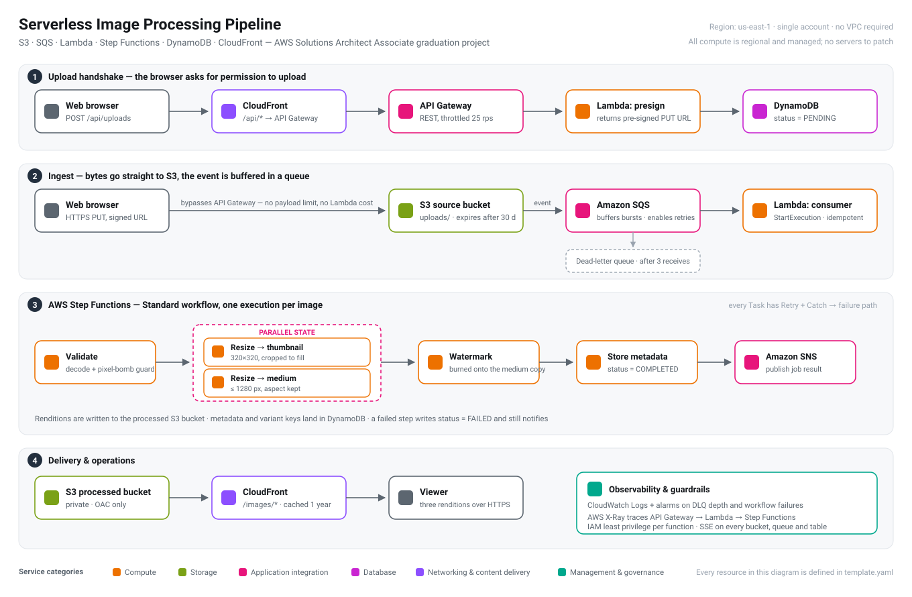

# Serverless Image Processing Pipeline

**AWS Solutions Architect – Associate · Graduation Project**

An event-driven image processing service built entirely from managed AWS services.
A user uploads a photo through a static web page; the file lands in S3, the event is
buffered in SQS, and a Step Functions workflow validates the image, produces three
renditions in parallel, watermarks one of them and records the result in DynamoDB.
The finished images are served worldwide from CloudFront.

There are no servers, no VPC, no load balancer and nothing to patch. Everything in
this repository is defined in a single CloudFormation/SAM template and deploys with
one command.

### 🔗 Live demo — https://d3l1cbrdqvb1hz.cloudfront.net

Drop in a photo and watch the five pipeline stages run. Measured on the deployed
stack: a 2720×1780 PNG settled to `COMPLETED` in **6.7 seconds**, producing a
320×320 thumbnail, a 1280×838 display copy and a watermarked copy. The two resize
branches entered at the same millisecond (`15:48:44.578`), confirming the `Parallel`
state fans out rather than running sequentially.

---

## Contents

- [Architecture](#architecture)
- [How a request flows](#how-a-request-flows)
- [Services used and why](#services-used-and-why)
- [Key design decisions](#key-design-decisions)
- [Well-Architected review](#well-architected-review)
- [Security posture](#security-posture)
- [Cost](#cost)
- [Repository layout](#repository-layout)
- [Deploying it yourself](#deploying-it-yourself)
- [Testing and verification](#testing-and-verification)
- [Observability](#observability)
- [Tearing it down](#tearing-it-down)
- [Limitations and next steps](#limitations-and-next-steps)

---

## Architecture



An editable version of the diagram is in
[`architecture/architecture.drawio`](architecture/architecture.drawio)
(open it at [app.diagrams.net](https://app.diagrams.net)), with a PNG export at
[`architecture/architecture.png`](architecture/architecture.png).

---

## How a request flows

**1 — Upload handshake.** The browser loads the static UI from CloudFront and calls
`POST /api/uploads` with the file name, MIME type and size. CloudFront forwards
`/api/*` to API Gateway, which invokes the `presign` Lambda. That function checks the
type and size, mints an image ID, writes a `PENDING` row to DynamoDB and returns a
**pre-signed S3 PUT URL** valid for five minutes.

**2 — Direct upload.** The browser `PUT`s the file straight to the S3 source bucket
using that URL. The bytes never pass through API Gateway or Lambda, which sidesteps the
10 MB API Gateway payload limit and means we pay nothing per megabyte uploaded.

**3 — Event, queued.** The `s3:ObjectCreated:*` notification on the `uploads/` prefix
sends a message to **SQS**, not straight to Lambda. A `queue-consumer` Lambda polls the
queue and calls `StartExecution` on the state machine, using the image ID as the
execution name so a duplicate S3 delivery is rejected rather than processed twice.
Messages that fail three times land in a dead-letter queue.

**4 — The workflow.** A **Step Functions** Standard workflow runs five states:

| State | What it does |
|---|---|
| `Validate` | Decodes the file to prove it is an image; rejects unsupported formats and images above 40 megapixels (a decompression-bomb guard that file size alone would miss). Sets `PROCESSING`. |
| `GenerateVariants` | A `Parallel` state running two `Resize` invocations at once: a 320×320 cropped thumbnail and a ≤1280 px display copy. |
| `Watermark` | Burns a caption onto the medium rendition — reading the already-normalised copy rather than the original, so this step is cheap no matter how big the upload was. |
| `StoreMetadata` | Writes dimensions, byte sizes and variant keys to DynamoDB and sets `COMPLETED`. |
| `NotifySuccess` | Publishes the job result to SNS. |

Every `Task` carries a `Retry` block for transient Lambda errors and a `Catch` that
routes to `MarkFailed` → `NotifyFailure`, so a failure is recorded in DynamoDB and
surfaced in the UI instead of leaving a spinner running forever.

**5 — Delivery.** Renditions are written to a private processed bucket that only
CloudFront can read, through an Origin Access Control. The browser polls
`GET /api/images/{id}` until the record settles, then loads the images from
`/images/*` on the same CloudFront domain — one origin, no CORS.

---

## Services used and why

| Service | Role in this design | Why this service |
|---|---|---|
| **Amazon S3** | Source bucket, processed bucket, static site bucket | Durable object storage with native event notifications; lifecycle rules expire raw uploads after 30 days and move renditions to Intelligent-Tiering after 30 days |
| **Amazon SQS + DLQ** | Buffers S3 events ahead of processing | Absorbs upload bursts, gives free retries with backoff, and isolates poison messages in the DLQ instead of blocking the pipeline |
| **AWS Lambda** | Pre-sign, queue consumption, validate, resize, watermark, store | Per-request billing and automatic concurrency; image work is bursty and idle most of the time, which is the worst possible fit for always-on instances |
| **Lambda Layer** | Ships Pillow to every processing function | Keeps the deployment package small and the dependency versioned in one place instead of duplicated across five functions |
| **AWS Step Functions** | Orchestrates validate → resize → watermark → store | Retries, error routing and the parallel fan-out are configuration, not code; the visual execution history makes a failed run self-explanatory |
| **Amazon DynamoDB** | Image metadata and job status | Single-digit-millisecond key lookups for the polling UI; a GSI on `status` + `uploadedAt` serves the "recently processed" gallery without a scan |
| **Amazon API Gateway** | REST front door for the pre-sign and status endpoints | Managed TLS, request throttling (25 rps, burst 50) and native Lambda integration |
| **Amazon CloudFront** | Single public entry point for UI, API and images | Edge caching for renditions, one origin for the browser so there is no CORS to configure, and OAC to keep both S3 buckets private |
| **Amazon SNS** | Job completion and failure notifications | Fan-out to email today, and a place to attach downstream consumers later without touching the workflow |
| **CloudWatch** | Logs, metrics, two alarms | Alerts when the DLQ becomes non-empty or a workflow execution fails |
| **AWS X-Ray** | Distributed tracing | Shows where latency actually sits across API Gateway → Lambda → Step Functions |

---

## Key design decisions

**Pre-signed URLs instead of uploading through the API.**
Routing a 10 MB file through API Gateway and Lambda would hit the 10 MB payload ceiling,
pay Lambda duration for a network transfer, and base64-encode the body on the way. A
pre-signed `PUT` moves the bytes browser-to-S3 and keeps the Lambda invocation to a few
milliseconds of JSON.

**SQS between S3 and the workflow, not a direct trigger.**
S3 can invoke Lambda directly, but then a throttle or a bad deploy loses the event —
S3's own retry budget is limited and invisible. With a queue in the middle, the message
survives, retries three times, and ends up in a DLQ you can inspect and redrive. This is
the single most exam-relevant decision in the project: *decouple producers from
consumers*.

**Step Functions rather than one large Lambda.**
The same work could be a single function, but then retries, partial failure and parallel
fan-out all become hand-written code. In a state machine they are declarative, and the
execution graph in the console shows exactly which step failed and with what input.

**Standard workflow, knowing the trade-off.**
Standard costs ~$25 per million state transitions; Express would cost roughly a tenth of
that. Standard is the right choice *here* because the visible execution history is the
whole point of a learning project — but for a high-volume production pipeline, Express
plus CloudWatch Logs would be the cost-correct answer. The template changes by one line.

**Idempotent execution names.**
S3 event delivery is at-least-once. Using the image ID as the Step Functions execution
name means a duplicate event fails with `ExecutionAlreadyExists`, which the consumer
treats as success. No double processing, no distributed lock.

**Deterministic bucket name in the queue policy.**
The source bucket needs the queue ARN, and the queue policy needs the bucket ARN — a
circular dependency CloudFormation will refuse. Writing the bucket name out with `!Sub`
in the policy instead of `!Ref` breaks the cycle. This is a very common real-world
CloudFormation trap.

**Validating by pixel count, not file size.**
A 2 MB PNG can decompress to several gigabytes in memory and take the function down. The
`Validate` step decodes the header and rejects anything above 40 megapixels before any
resize work is scheduled.

---

## Well-Architected review

| Pillar | How this design addresses it |
|---|---|
| **Operational excellence** | 100% infrastructure as code; one-command deploy and teardown; structured logs; alarms on DLQ depth and workflow failures; the state machine's execution history is the runbook |
| **Security** | Both content buckets are private with all public access blocked and reachable only through CloudFront OAC; SSE on every bucket, queue and table; per-function IAM roles scoped to a single bucket or table; upload URLs expire in five minutes and are bound to one key and content type; API Gateway throttling caps abuse |
| **Reliability** | SQS decoupling with a three-attempt redrive to a DLQ; retries with exponential backoff on every workflow task; a `Catch` path that records failures instead of losing them; S3 and DynamoDB are multi-AZ by default |
| **Performance efficiency** | Renditions generated in parallel; resize functions given 1536 MB because Pillow is CPU-bound and Lambda scales CPU with memory; CloudFront caches renditions for a year under immutable keys; DynamoDB GSI avoids table scans |
| **Cost optimisation** | Pay-per-request everywhere — the idle cost of this stack is effectively storage only; lifecycle rules expire originals after 30 days and tier renditions; uploads bypass Lambda entirely; on-demand DynamoDB avoids provisioned capacity for a spiky workload |
| **Sustainability** | No idle compute; images stored once and cached at the edge rather than regenerated per request |

---

## Security posture

- **No public buckets.** All three buckets set `BlockPublicAcls`, `BlockPublicPolicy`,
  `IgnorePublicAcls` and `RestrictPublicBuckets`. The website and processed buckets are
  readable only by the CloudFront distribution, enforced by an `AWS:SourceArn` condition
  in the bucket policy.
- **Least-privilege IAM.** Every function gets its own role from a SAM policy template —
  `resize` can read the source bucket and write the processed bucket, and nothing else.
  No wildcard resource ARNs outside the logging and X-Ray statements, which require them.
- **Encryption at rest** on every bucket (SSE-S3), both queues (SSE-SQS) and the DynamoDB
  table. Encryption in transit is enforced by CloudFront's `redirect-to-https`.
- **Bounded upload authority.** A pre-signed URL is valid for one bucket, one key, one
  content type and five minutes.
- **Input validation before compute.** Type, size and pixel-count checks run before any
  processing is scheduled.
- **Abuse control.** API Gateway is throttled at 25 requests/second with a burst of 50.

---

## Cost

With a new AWS account this project runs **inside the Free Tier** for any realistic demo
volume: Lambda's 1M monthly requests, SQS's 1M requests, CloudFront's 1 TB egress and
Step Functions' 4,000 monthly state transitions are all permanently free, and S3,
DynamoDB and API Gateway sit in the 12-month tier.

Beyond the free tier, processing **1,000 images of roughly 2 MB each** costs about:

| Component | Estimate |
|---|---|
| Step Functions (≈10 transitions × 1,000) | $0.25 |
| Lambda duration (≈9 GB-seconds per image) | $0.15 |
| CloudFront egress (≈600 MB) | $0.05 |
| S3 requests and one month of storage | $0.08 |
| API Gateway, SQS, DynamoDB, SNS | $0.03 |
| **Total** | **≈ $0.56 per 1,000 images** |

Step Functions Standard is the largest line item; switching that one property to Express
would cut the total by roughly half. See [`docs/cost-estimate.md`](docs/cost-estimate.md)
for the workings. Prices are us-east-1 list prices and are estimates, not a quote.

> **Leaving the stack deployed costs almost nothing, but it is not zero** — S3 storage and
> the Intelligent-Tiering monitoring charge continue. Run the teardown script when you are
> finished.

---

## Repository layout

```
.
├── template.yaml                  # every AWS resource, in one SAM template
├── statemachine/
│   └── pipeline.asl.json          # Step Functions definition (Amazon States Language)
├── src/
│   ├── presign/                   # POST /uploads  -> pre-signed PUT URL
│   ├── status/                    # GET  /images, GET /images/{id}
│   ├── queue_consumer/            # SQS -> StartExecution
│   ├── validate/                  # workflow step 1
│   ├── resize/                    # workflow step 2 (runs twice, in parallel)
│   ├── watermark/                 # workflow step 3
│   └── store/                     # workflow step 4 + failure path
├── frontend/
│   └── index.html                 # the demo UI, served from S3 via CloudFront
├── layers/pillow/                 # built by scripts/build-layer.* (not committed)
├── scripts/
│   ├── build-layer.ps1 / .sh      # fetches the Linux Pillow wheel — no Docker needed
│   ├── deploy.ps1   / .sh         # build, deploy, publish the UI, invalidate the CDN
│   └── cleanup.ps1  / .sh         # empty the buckets, delete the stack
├── architecture/                  # diagram as SVG, PNG and editable .drawio
└── docs/
    ├── cost-estimate.md
    └── testing.md
```

---

## Deploying it yourself

### Prerequisites

| Tool | Notes |
|---|---|
| An AWS account | The Free Tier covers this project |
| [AWS CLI v2](https://docs.aws.amazon.com/cli/latest/userguide/getting-started-install.html) | Run `aws configure` with an access key, or `aws configure sso` |
| [AWS SAM CLI](https://docs.aws.amazon.com/serverless-application-model/latest/developerguide/install-sam-cli.html) | Builds and deploys the template |
| Python 3.9+ | Only used locally, to download the Lambda layer wheel. `sam build` needs no local Python: these functions declare no pip dependencies, because Pillow arrives through the layer |

Docker is **not** required. `scripts/build-layer.*` asks pip for the Linux `manylinux`
wheel explicitly, so the layer builds correctly from Windows or macOS.

### Deploy

```powershell
# Windows / PowerShell
git clone <your-fork-url> && cd aws-saa-image-pipeline
.\scripts\deploy.ps1 -StackName imagepipe -Region us-east-1 -Email you@example.com
```

```bash
# Linux / macOS
git clone <your-fork-url> && cd aws-saa-image-pipeline
STACK_NAME=imagepipe REGION=us-east-1 EMAIL=you@example.com ./scripts/deploy.sh
```

The script builds the Pillow layer, runs `sam build` and `sam deploy`, uploads the UI to
the website bucket and invalidates the CloudFront cache. It prints the live URL when it
finishes.

The first deploy takes roughly **8–12 minutes**, almost all of it CloudFront. Later
deploys take about a minute. If you passed an email address, confirm the SNS
subscription from your inbox to receive job notifications.

### What you get

```
Outputs
  SiteUrl                 https://dxxxxxxxxxxxxx.cloudfront.net
  ApiUrl                  https://xxxxxxxxxx.execute-api.us-east-1.amazonaws.com/prod
  SourceBucketName        imagepipe-source-123456789012-us-east-1
  DestinationBucketName   imagepipe-processed-123456789012-us-east-1
  StateMachineArn         arn:aws:states:us-east-1:123456789012:stateMachine:imagepipe-pipeline
  ...
```

Open `SiteUrl`, drop in a photo, and watch the five pipeline steps tick over.

---

## Testing and verification

Full commands are in [`docs/testing.md`](docs/testing.md). The short version:

**Happy path.** Upload a JPEG through the UI. Within a few seconds you should see a
thumbnail, a medium rendition and a watermarked copy, plus the original's format and
dimensions read back from DynamoDB.

**Failure path and the DLQ.** Upload a text file renamed to `.jpg` directly to the source
bucket with the AWS CLI. `Validate` fails to decode it, `Catch` routes to `MarkFailed`,
DynamoDB records `status = FAILED` with the reason, and SNS sends a failure notification.

**Idempotency.** Copy the same object over itself in the source bucket. A second S3 event
fires, but the execution name already exists, so no duplicate processing happens — visible
in the consumer's CloudWatch logs.

**Parallelism.** Open any execution in the Step Functions console: the two `Resize`
branches start at the same timestamp.

**Caching.** Request a rendition twice and compare the `x-cache` response header —
`Miss from cloudfront`, then `Hit from cloudfront`.

---

## Observability

| What to look at | Where |
|---|---|
| Per-image workflow graph, inputs and outputs of every step | Step Functions console → `imagepipe-pipeline` → Executions |
| End-to-end latency breakdown | X-Ray → Service map |
| Function logs | CloudWatch → Log groups → `/aws/lambda/imagepipe-*` |
| Poison messages | SQS → `imagepipe-processing-dlq` |
| Alarms | CloudWatch → `imagepipe-dlq-not-empty`, `imagepipe-workflow-failures` |

---

## Tearing it down

```powershell
.\scripts\cleanup.ps1 -StackName imagepipe -Region us-east-1
```

```bash
STACK_NAME=imagepipe REGION=us-east-1 ./scripts/cleanup.sh
```

CloudFormation cannot delete a bucket that still contains objects, so the script empties
all three buckets first, then deletes the stack and waits for it to finish.

---

## Limitations and next steps

Deliberately out of scope, and what I would add next:

- **No authentication.** Anyone with the URL can upload. The natural next step is a
  Cognito User Pool with a JWT authorizer on API Gateway, so uploads are attributed to a
  user and the gallery is per-account.
- **No WAF.** API Gateway throttling is the only abuse control. A rate-based WAF rule and
  the OWASP managed rule set would belong in front of CloudFront in production.
- **Polling, not push.** The UI polls the status endpoint every two seconds. WebSockets on
  API Gateway, or an SNS→AppSync subscription, would push the result instead.
- **Single region.** S3 Cross-Region Replication plus a second CloudFront origin would
  make this multi-region; the DynamoDB table would become a Global Table.
- **No CI/CD.** `sam deploy` runs from a laptop. CodePipeline with `sam deploy --no-execute-changeset`
  and a manual approval gate would be the production path.
- **Upload size is declared, not enforced.** A pre-signed `PUT` cannot cap the body
  size; the check happens on the size the client reports. A pre-signed POST policy with
  a `content-length-range` condition would enforce it at S3, at the cost of a more
  awkward browser upload. The `Validate` step is the real backstop.
- **Basic watermark.** Pillow's built-in font keeps the layer small; a real product would
  ship a licensed typeface and support positioning and opacity options.

---

## Learning outcomes covered

The project brief lists six outcomes for this idea. Where each one lives:

| Outcome | Where |
|---|---|
| Event-driven architecture with S3 notifications and SQS | `template.yaml` → `SourceBucket.NotificationConfiguration`, `ProcessingQueue` |
| Why SQS decoupling improves resilience and enables retries | [Key design decisions](#key-design-decisions); `RedrivePolicy` and the DLQ alarm |
| Lambda Layers for large dependencies | `PillowLayer` + `scripts/build-layer.*` |
| Multi-step orchestration with Step Functions | `statemachine/pipeline.asl.json` — `Parallel`, `Retry`, `Catch` |
| S3 lifecycle policies across storage classes | `SourceBucket` expiration, `DestinationBucket` Intelligent-Tiering transition |
| CloudFront with appropriate cache behaviours | `Distribution` — three origins, caching disabled for `/api/*`, one year for `/images/*` |

---

## License

MIT. Built as a graduation project for the Manara AWS Solutions Architect – Associate track.
